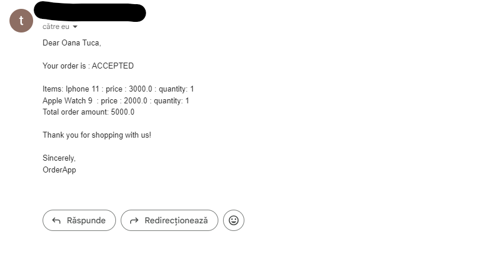
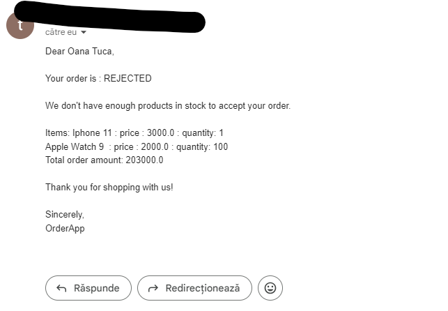

# FeedbackService

#### This is the service that consumes messages from the feedback-topic sent by validation services, and stores them in a database. After that, it checks if both validations are accepted, updates the order status, stock, and notifies the customer. If one of the validations is incorrect: either the bank details are incorrect or the products are not available in stock, the order will be rejected, and the customer will be notified accordingly.

###### When a message is received on the topic, it will be processed and save as follows:
- Extracts order ID and response from Kafka message.
- Processes validation response and updates order status accordingly.
- Performs actions based on the order status (accept, reject, pending).
- Acknowledges the message after processing.
```
 Order order = orderRepository.getReferenceById(orderId);
        String[] details = response.split("_");
        ValidationResponse validationResponse = ValidationResponse.builder()
                .orderId(orderId)
                .response(details[1])
                .typeOfValidation(details[0])
                .build();
        validationResponseRepository.save(validationResponse);

```

###### This is how it looks in the database:

````
id      order_id        response           type_of_validation
1	    116         "ACCEPTED"	        "StockService"
2	    116	        "ACCEPTED"	        "PaymentService"
````

###### After verifying that both services have sent a response message with 'accepted', an email will be sent to the user.

##### Feedback Service Configuration
**KafkaErrorHandler**
- The KafkaErrorHandler class defines a custom error handler for handling exceptions that occur during message consumption by the Kafka listener in the Feedback Service.
Methods:
- handleOtherException: Handles exceptions other than deserialization exceptions, seeking to the next offset and committing the offset.
- handleOne: Handles a single exception occurred during message consumption, seeking to the next offset and committing the offset.
- handle: Common method to handle exceptions and move messages to Dead Letter Topic (DLT) in case of deserialization exceptions.


###### Mail configuration:

```
        JavaMailSenderImpl mailSender = new JavaMailSenderImpl();
        mailSender.setHost("smtp.gmail.com");
        mailSender.setPort(587);
```

###### Email for accepted order:



###### Rejected order:

