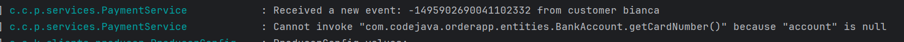

# Payment Service

## This is a bank data validation service. It reads a command from the order-topic, extracts the bank account details, and validates them.

#### Logic and Functionality PaymentService:

[PaymentService.java](https://github.com/OanaBiancaTuca/OrderAppProject/blob/master/PaymentService/src/main/java/com/codejava/paymentservice/services/PaymentService.java)
***Payment Handling:***

- This service receives orders from the "order-topic" Kafka message broker.
- Using the @KafkaListener annotation, the service is configured to listen for messages received on the "order-topic".
- Upon receiving an order, the service processes it and validates the associated bank account details.

1. card number must consist of exactly 16 digits.
2. CVV must consist of exactly 3 digits.
3. accountHolderName and nameOnCard fields must not be null.
4. IBAN in Romania consists of 24 characters:

- 2-letter country code
- 2-digit check number
- 4-characters from the bank's bank code
- 16-digit code for the bank account number

5. must have a date greater than or equal to the day the order is made.

#### After validations, the payment service will send a message on the feedback-topic with such a response.

```
PaymentService_REJECTED /
PaymentService_ACCEPTED
```

##### Error Handling and Dead Letter Topic (DLT) Strategy:

[KafkaConsumerConfig.java](https://github.com/OanaBiancaTuca/OrderAppProject/blob/master/PaymentService/src/main/java/com/codejava/paymentservice/configs/KafkaConsumerConfig.java)

- Utilizes Spring's DefaultErrorHandler to handle errors that occur during message consumption by Kafka listeners.
- Errors are retried up to a maximum of 3 times, with a delay of 5000 milliseconds between retries.
- Certain exceptions, such as NotRetryableException and RetryableException, are explicitly marked for retry or non-retry
  based on application logic.
- Implements a Dead Letter Topic (DLT) strategy for handling messages that cannot be successfully processed after
  retries.
- Uses DeadLetterPublishingRecoverer to move failed messages to a separate topic for further analysis or manual
  processing.

***Exception Handling:***

- In case of a network exception (ResourceAccessException), the service will attempt to retry processing the order as
  this is considered a transient error.
- If a NullPointerException occurs, it indicates that the order received does not have an associated bank account. This
  situation is treated as a non-retryable error since it requires manual intervention or further investigation to
  resolve.
- Other exceptions, such as HTTP-related errors (HttpServerErrorException), are also treated as non-retryable errors and
  will not be retried.
- All other exceptions are handled similarly as non-retryable errors and will not be retried.

## How it works

1. Send a valid order in Postman
   
2. Send order to order-topic
   
3. Consume message from PaymentService, validate and send to feedback-topic
   
4. Consume message from FeedbackService
   
5. How the order looks in Kafka-ui
   

```
{
	"Value": "{\"orderId\":227,\"items\":[{\"orderItemId\":1,\"product\":{\"productId\":1,\"name\":\"Iphone 11\",\"price\":3000.0,\"quantity\":11},\"quantity\":1}],\"user\":{\"id\":5,\"username\":\"Bianca\",\"password\":\"$2a$10$SdZlTCHoQl5HLQRzDnfG2OE2WAoIuYX7nQHk7cNQfUpBCwFEyrMU2\",\"email\":\"bianca@gmail.com\",\"name\":\"bianca\",\"address\":\"\",\"phoneNumber\":\"\",\"enabled\":true,\"accountNonExpired\":true,\"credentialsNonExpired\":true,\"accountNonLocked\":true},\"bankAccount\":{\"accountId\":5,\"cardNumber\":\"1234567841234567\",\"cvv\":123,\"expiryMonth\":12,\"expiryYear\":2024,\"nameOnCard\":\"Bianca\",\"accountHolderName\":\"BCR\",\"ibanNumber\":\"RO49AAAA1131007593840001\"},\"totalAmount\":3000.0,\"status\":\"PENDING\"}",
	"Offset": 4,
	"Key": "\u0000\u0000\u0000\u0000\u0000\u0000\u0000�",
	"Partition": 1,
	"Headers": {
		"__TypeId__": "com.codejava.orderapp.entities.order.Order"
	},
	"Timestamp": "2024-03-13T12:47:10.203Z"
}
```

### Bad Request

1. Send an invalid order
   
2. Send message to order-topic
   
3. Consume message from PaymentService and move to DLT
   
4. How the order is saved in order-topic.DLT
   